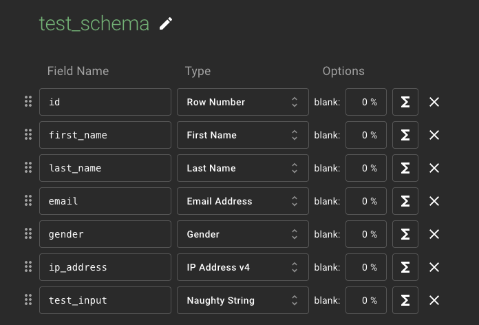
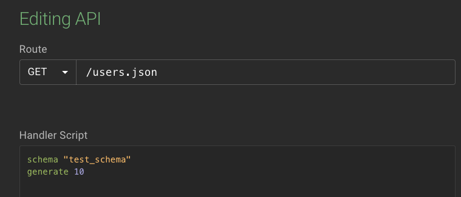
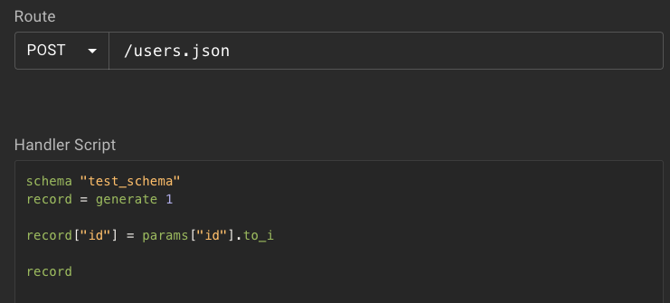

# Antes de ejecutar usted debe:

- Crear los servicios en su cuenta de mockaroo
- Modificar el archivo App.js para agregar su APIKey en la linea 9

# Información de los schemas y servicios en Mockaroo

## Definición Schema

## Definición Servicio GET

## Definición Servicio POST

